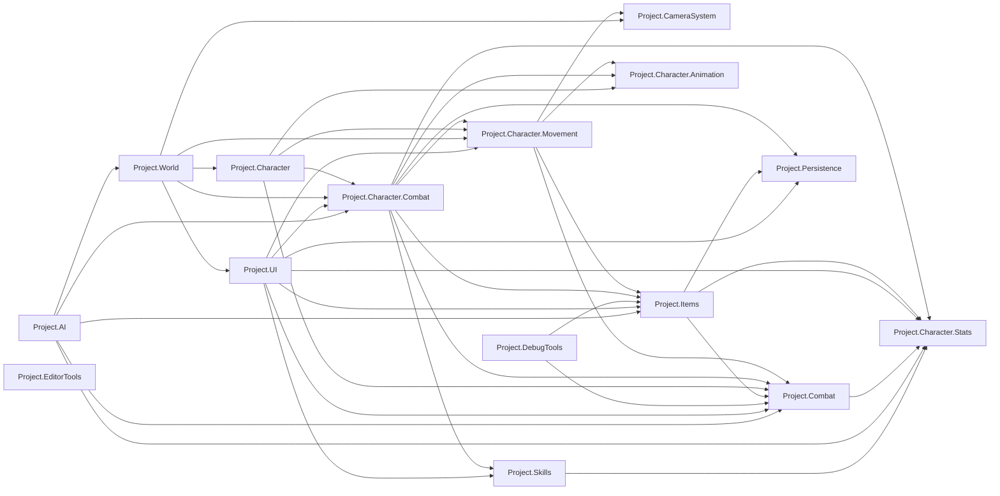
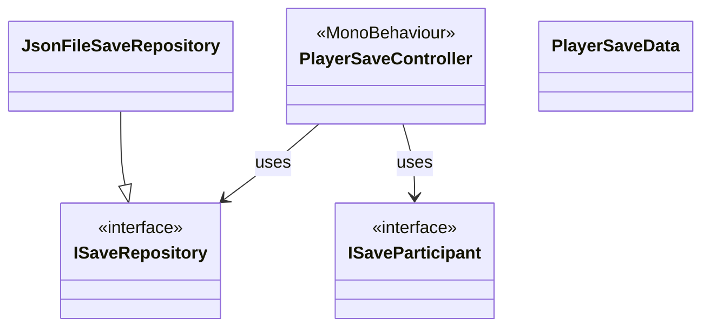
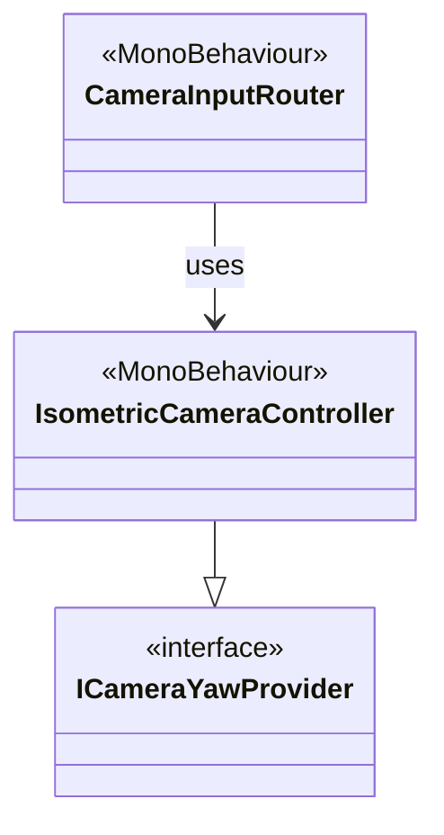
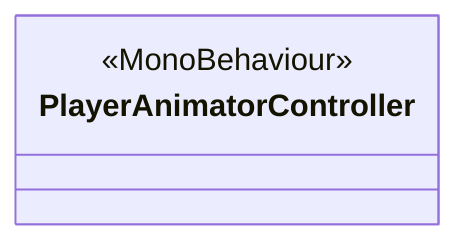
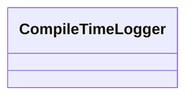

# Class Diagram — MMO Project

Generated by extracting every class, interface, struct and enum declaration under `Assets/Scripts`, together with each type's inheritance/interface list and its composition dependencies (fields and properties whose type is another project class). The module graph comes straight from each folder's `.asmdef` `references` list, so it reflects what the compiler actually enforces, not just an impression from reading code.

**How to read the diagrams:**

- The first diagram is the **module graph** — one node per Assembly Definition (folder), one arrow per `references` entry. This is the big picture: which subsystem can see which.
- Each following section is one assembly's **class diagram**. Solid arrows (`-->`) are dependencies to another class in the *same* assembly. Dashed arrows (`..>`) are dependencies that reach *outside* the assembly — the target is shown as a small stub node tagged `<<Project.X>>` with its true home, so you can see at a glance how much a module reaches beyond its own boundary.
- `--|>` is inheritance or interface implementation. `<<interface>>`, `<<enumeration>>`, `<<struct>>`, `<<MonoBehaviour>>` and `<<ScriptableObject>>` are stereotype tags — the last two mark Unity's own base classes, which are omitted as arrows (nearly everything is a `MonoBehaviour`) since they add no architectural information.
- Sections are ordered roughly bottom-up: modules with no dependencies of their own (`Project.Character.Stats`, `Project.Combat`, `Project.Persistence`, `Project.Skills`, `Project.CameraSystem`, `Project.Character.Animation`) come first, followed by modules that build on them, ending with `Project.World` and the debug/editor tooling.

A few things worth noticing while reading:

- `Project.Persistence` and `Project.Character.Stats` are the project's true foundation: everything save-related implements `ISaveParticipant`, and `CharacterStatsHolder`/`CharacterStatsDefinition` are read by both the player (`Project.Character.Combat`) and enemies (`Project.AI`) — the same data-driven asset backs both, which is why giving an enemy the wrong stats asset (as happened with Poring/Poporing pointing at `PlayerStats`) silently breaks combat rewards without throwing any error.
- `Project.Character.Combat` is the largest and most-depended-upon module (20 types) — it is where the player's RPG-facing state lives (experience, stats, currency, skills, class), and nearly every other module that touches "the player" ends up depending on it.
- `Project.UI` depends on six other modules but nothing depends on it back, except `Project.World` (for the two world-space follower components attached to the player) — consistent with UI sitting at the top of the dependency graph, as it should.
- `PersistentPlayerAnchor` (`Project.World`) is the single most cross-cutting class outside `Project.Character.Combat`: it holds references into `Project.Character`, `Project.Character.Movement` and `Project.UI` simultaneously, because it is what survives `DontDestroyOnLoad` across map switches and re-anchors everything else after each load.

---

## Module dependency graph

Generated from each folder's `.asmdef` `references` list — this is the authoritative, compiler-enforced dependency graph between the project's assemblies.



## `Project.Character.Stats`

References: none (leaf module)



```mermaid
classDiagram
    class CharacterBaseStats["CharacterBaseStats"]
    class CharacterClass["CharacterClass"]
    <<enumeration>> CharacterClass
    class CharacterStatsDefinition["CharacterStatsDefinition"]
    <<ScriptableObject>> CharacterStatsDefinition
    class CharacterStatsHolder["CharacterStatsHolder"]
    <<MonoBehaviour>> CharacterStatsHolder
    class ClassIconEntry["ClassIconEntry"]
    <<struct>> ClassIconEntry
    class ClassIconLookup["ClassIconLookup"]
    <<ScriptableObject>> ClassIconLookup
    class FlatStatPointCostStrategy["FlatStatPointCostStrategy"]
    class IPlayerClassProvider["IPlayerClassProvider"]
    <<interface>> IPlayerClassProvider
    class IPlayerLevelProvider["IPlayerLevelProvider"]
    <<interface>> IPlayerLevelProvider
    class IStatPointCostStrategy["IStatPointCostStrategy"]
    <<interface>> IStatPointCostStrategy
    class IStatPointsPerLevelStrategy["IStatPointsPerLevelStrategy"]
    <<interface>> IStatPointsPerLevelStrategy
    class IStatProvider["IStatProvider"]
    <<interface>> IStatProvider
    class ISubStatsCalculator["ISubStatsCalculator"]
    <<interface>> ISubStatsCalculator
    class RagnarokStatPointCostStrategy["RagnarokStatPointCostStrategy"]
    class RagnarokStatPointsPerLevelStrategy["RagnarokStatPointsPerLevelStrategy"]
    class StatType["StatType"]
    <<enumeration>> StatType
    class SubStatsCalculator["SubStatsCalculator"]
    CharacterBaseStats --|> IStatProvider
    FlatStatPointCostStrategy --|> IStatPointCostStrategy
    RagnarokStatPointCostStrategy --|> IStatPointCostStrategy
    RagnarokStatPointsPerLevelStrategy --|> IStatPointsPerLevelStrategy
    SubStatsCalculator --|> ISubStatsCalculator
    CharacterBaseStats --> IStatPointCostStrategy : uses
    CharacterBaseStats --> StatType : uses
    CharacterStatsHolder --> CharacterStatsDefinition : uses
    ClassIconEntry --> CharacterClass : uses
    ClassIconLookup --> CharacterClass : uses
    ClassIconLookup --> ClassIconEntry : uses
```

## `Project.Combat`

References: `Project.Character.Stats`

```mermaid
classDiagram
    class Element["Element"]
    <<enumeration>> Element
    class HealthComponent["HealthComponent"]
    <<MonoBehaviour>> HealthComponent
    class IDamageModifier["IDamageModifier"]
    <<interface>> IDamageModifier
    class IDamageable["IDamageable"]
    <<interface>> IDamageable
    class ManaComponent["ManaComponent"]
    <<MonoBehaviour>> ManaComponent
    class PlayerFeedbackChannel["PlayerFeedbackChannel"]
    HealthComponent --|> IDamageable
    HealthComponent --> IDamageModifier : uses
    HealthComponent ..> CharacterStatsHolder : uses
    ManaComponent ..> CharacterStatsHolder : uses
    class CharacterStatsHolder["CharacterStatsHolder"]
    <<Project.Character.Stats>> CharacterStatsHolder
```

## `Project.Persistence`

References: none (leaf module)



## `Project.Skills`

References: `Project.Character.Stats`

```mermaid
classDiagram
    class SkillAvailability["SkillAvailability"]
    <<enumeration>> SkillAvailability
    class SkillDamageType["SkillDamageType"]
    <<enumeration>> SkillDamageType
    class SkillDatabase["SkillDatabase"]
    <<ScriptableObject>> SkillDatabase
    class SkillDefinition["SkillDefinition"]
    <<ScriptableObject>> SkillDefinition
    class SkillEffectType["SkillEffectType"]
    <<enumeration>> SkillEffectType
    class SkillTargetType["SkillTargetType"]
    <<enumeration>> SkillTargetType
    SkillDatabase --> SkillDefinition : uses
    SkillDefinition --> SkillDamageType : uses
    SkillDefinition --> SkillEffectType : uses
    SkillDefinition --> SkillTargetType : uses
    SkillDefinition ..> CharacterClass : uses
    class CharacterClass["CharacterClass"]
    <<Project.Character.Stats>> CharacterClass
```

## `Project.Items`

References: `Project.Character.Stats`, `Project.Persistence`, `Project.Combat`

```mermaid
classDiagram
    class EquipmentManager["EquipmentManager"]
    <<MonoBehaviour>> EquipmentManager
    class EquipmentSlot["EquipmentSlot"]
    <<enumeration>> EquipmentSlot
    class EquippedRecord["EquippedRecord"]
    class Inventory["Inventory"]
    class ItemDatabase["ItemDatabase"]
    <<ScriptableObject>> ItemDatabase
    class ItemDefinition["ItemDefinition"]
    <<ScriptableObject>> ItemDefinition
    class ItemPickup["ItemPickup"]
    <<MonoBehaviour>> ItemPickup
    class ItemType["ItemType"]
    <<enumeration>> ItemType
    class LootEntry["LootEntry"]
    <<struct>> LootEntry
    class LootTableDefinition["LootTableDefinition"]
    <<ScriptableObject>> LootTableDefinition
    class PlayerInventory["PlayerInventory"]
    <<MonoBehaviour>> PlayerInventory
    class StatModifiers["StatModifiers"]
    <<struct>> StatModifiers
    class WeaponType["WeaponType"]
    <<enumeration>> WeaponType
    EquipmentManager --|> ISaveParticipant
    PlayerInventory --|> ISaveParticipant
    EquipmentManager --> EquipmentSlot : uses
    EquipmentManager --> EquippedRecord : uses
    EquipmentManager --> ItemDatabase : uses
    EquipmentManager --> ItemDefinition : uses
    EquipmentManager --> PlayerInventory : uses
    EquippedRecord --> EquipmentSlot : uses
    EquippedRecord --> ItemDatabase : uses
    EquippedRecord --> ItemDefinition : uses
    EquippedRecord --> PlayerInventory : uses
    ItemDatabase --> ItemDefinition : uses
    ItemDefinition --> EquipmentSlot : uses
    ItemDefinition --> ItemType : uses
    ItemDefinition --> StatModifiers : uses
    ItemDefinition --> WeaponType : uses
    ItemPickup --> ItemDefinition : uses
    LootEntry --> ItemDefinition : uses
    LootTableDefinition --> LootEntry : uses
    PlayerInventory --> Inventory : uses
    PlayerInventory --> ItemDatabase : uses
    EquipmentManager ..> HealthComponent : uses
    EquipmentManager ..> IPlayerClassProvider : uses
    EquipmentManager ..> IPlayerLevelProvider : uses
    EquippedRecord ..> HealthComponent : uses
    EquippedRecord ..> IPlayerClassProvider : uses
    EquippedRecord ..> IPlayerLevelProvider : uses
    ItemDefinition ..> CharacterClass : uses
    class CharacterClass["CharacterClass"]
    <<Project.Character.Stats>> CharacterClass
    class HealthComponent["HealthComponent"]
    <<Project.Combat>> HealthComponent
    class IPlayerClassProvider["IPlayerClassProvider"]
    <<Project.Character.Stats>> IPlayerClassProvider
    class IPlayerLevelProvider["IPlayerLevelProvider"]
    <<Project.Character.Stats>> IPlayerLevelProvider
    class ISaveParticipant["ISaveParticipant"]
    <<Project.Persistence>> ISaveParticipant
```

## `Project.CameraSystem`

References: none (leaf module)



## `Project.Character.Animation`

References: none (leaf module)



## `Project.Character.Movement`

References: `Project.CameraSystem`, `Project.Combat`, `Project.Items`, `Project.Character.Animation`

```mermaid
classDiagram
    class CharacterMovementController["CharacterMovementController"]
    <<MonoBehaviour>> CharacterMovementController
    class ClickToMoveProvider["ClickToMoveProvider"]
    class DirectionalMovementProvider["DirectionalMovementProvider"]
    class IMovementIntent["IMovementIntent"]
    <<interface>> IMovementIntent
    class PlayerInputRouter["PlayerInputRouter"]
    <<MonoBehaviour>> PlayerInputRouter
    class PlayerLootController["PlayerLootController"]
    <<MonoBehaviour>> PlayerLootController
    class PlayerTargetSelector["PlayerTargetSelector"]
    <<MonoBehaviour>> PlayerTargetSelector
    CharacterMovementController --> ClickToMoveProvider : uses
    CharacterMovementController --> DirectionalMovementProvider : uses
    PlayerInputRouter --> CharacterMovementController : uses
    PlayerInputRouter --> PlayerLootController : uses
    PlayerInputRouter --> PlayerTargetSelector : uses
    PlayerLootController --> CharacterMovementController : uses
    CharacterMovementController ..> ICameraYawProvider : uses
    CharacterMovementController ..> PlayerAnimatorController : uses
    PlayerLootController ..> HealthComponent : uses
    PlayerLootController ..> ItemPickup : uses
    PlayerLootController ..> PlayerInventory : uses
    PlayerTargetSelector ..> IDamageable : uses
    class HealthComponent["HealthComponent"]
    <<Project.Combat>> HealthComponent
    class ICameraYawProvider["ICameraYawProvider"]
    <<Project.CameraSystem>> ICameraYawProvider
    class IDamageable["IDamageable"]
    <<Project.Combat>> IDamageable
    class ItemPickup["ItemPickup"]
    <<Project.Items>> ItemPickup
    class PlayerAnimatorController["PlayerAnimatorController"]
    <<Project.Character.Animation>> PlayerAnimatorController
    class PlayerInventory["PlayerInventory"]
    <<Project.Items>> PlayerInventory
```

## `Project.Character.Combat`

References: `Project.Character.Stats`, `Project.Combat`, `Project.Items`, `Project.Character.Movement`, `Project.Skills`, `Project.Character.Animation`, `Project.Persistence`

```mermaid
classDiagram
    class CombatRangeMath["CombatRangeMath"]
    class EquippedStatsView["EquippedStatsView"]
    class IExperienceCurve["IExperienceCurve"]
    <<interface>> IExperienceCurve
    class IJobExperienceCurve["IJobExperienceCurve"]
    <<interface>> IJobExperienceCurve
    class LinearExperienceCurve["LinearExperienceCurve"]
    class LinearJobExperienceCurve["LinearJobExperienceCurve"]
    class PlayerBlockController["PlayerBlockController"]
    <<MonoBehaviour>> PlayerBlockController
    class PlayerClassController["PlayerClassController"]
    <<MonoBehaviour>> PlayerClassController
    class PlayerCombatController["PlayerCombatController"]
    <<MonoBehaviour>> PlayerCombatController
    class PlayerCurrency["PlayerCurrency"]
    <<MonoBehaviour>> PlayerCurrency
    class PlayerElementController["PlayerElementController"]
    <<MonoBehaviour>> PlayerElementController
    class PlayerExperience["PlayerExperience"]
    <<MonoBehaviour>> PlayerExperience
    class PlayerJobProgress["PlayerJobProgress"]
    <<MonoBehaviour>> PlayerJobProgress
    class PlayerNameProvider["PlayerNameProvider"]
    <<MonoBehaviour>> PlayerNameProvider
    class PlayerSkillBook["PlayerSkillBook"]
    <<MonoBehaviour>> PlayerSkillBook
    class PlayerSkillCaster["PlayerSkillCaster"]
    <<MonoBehaviour>> PlayerSkillCaster
    class PlayerSkillHotbar["PlayerSkillHotbar"]
    <<MonoBehaviour>> PlayerSkillHotbar
    class PlayerStatsController["PlayerStatsController"]
    <<MonoBehaviour>> PlayerStatsController
    class SkillInputRouter["SkillInputRouter"]
    <<MonoBehaviour>> SkillInputRouter
    class SkillTargetingController["SkillTargetingController"]
    <<MonoBehaviour>> SkillTargetingController
    EquippedStatsView --|> IStatProvider
    LinearExperienceCurve --|> IExperienceCurve
    LinearJobExperienceCurve --|> IJobExperienceCurve
    PlayerBlockController --|> IDamageModifier
    PlayerClassController --|> IPlayerClassProvider
    PlayerClassController --|> ISaveParticipant
    PlayerCurrency --|> ISaveParticipant
    PlayerElementController --|> ISaveParticipant
    PlayerExperience --|> ISaveParticipant
    PlayerJobProgress --|> ISaveParticipant
    PlayerSkillBook --|> ISaveParticipant
    PlayerSkillHotbar --|> ISaveParticipant
    PlayerStatsController --|> IPlayerLevelProvider
    PlayerStatsController --|> ISaveParticipant
    PlayerBlockController --> PlayerClassController : uses
    PlayerCombatController --> PlayerClassController : uses
    PlayerCombatController --> PlayerStatsController : uses
    PlayerExperience --> IExperienceCurve : uses
    PlayerExperience --> PlayerStatsController : uses
    PlayerJobProgress --> IJobExperienceCurve : uses
    PlayerSkillBook --> PlayerClassController : uses
    PlayerSkillBook --> PlayerJobProgress : uses
    PlayerSkillCaster --> PlayerSkillBook : uses
    PlayerSkillCaster --> PlayerStatsController : uses
    SkillInputRouter --> PlayerSkillCaster : uses
    SkillInputRouter --> PlayerSkillHotbar : uses
    SkillTargetingController --> PlayerSkillCaster : uses
    EquippedStatsView ..> CharacterBaseStats : uses
    EquippedStatsView ..> EquipmentManager : uses
    PlayerClassController ..> CharacterClass : uses
    PlayerCombatController ..> CharacterMovementController : uses
    PlayerCombatController ..> EquipmentManager : uses
    PlayerCombatController ..> ManaComponent : uses
    PlayerCombatController ..> PlayerAnimatorController : uses
    PlayerCombatController ..> PlayerTargetSelector : uses
    PlayerElementController ..> Element : uses
    PlayerExperience ..> HealthComponent : uses
    PlayerExperience ..> IStatPointsPerLevelStrategy : uses
    PlayerExperience ..> ManaComponent : uses
    PlayerSkillBook ..> SkillDatabase : uses
    PlayerSkillBook ..> SkillDefinition : uses
    PlayerSkillCaster ..> HealthComponent : uses
    PlayerSkillCaster ..> ManaComponent : uses
    PlayerSkillCaster ..> PlayerAnimatorController : uses
    PlayerSkillCaster ..> PlayerTargetSelector : uses
    PlayerSkillCaster ..> SkillDefinition : uses
    PlayerSkillHotbar ..> SkillDatabase : uses
    PlayerSkillHotbar ..> SkillDefinition : uses
    PlayerStatsController ..> CharacterBaseStats : uses
    PlayerStatsController ..> EquipmentManager : uses
    PlayerStatsController ..> IStatProvider : uses
    PlayerStatsController ..> ISubStatsCalculator : uses
    SkillTargetingController ..> PlayerTargetSelector : uses
    SkillTargetingController ..> SkillDefinition : uses
    class CharacterBaseStats["CharacterBaseStats"]
    <<Project.Character.Stats>> CharacterBaseStats
    class CharacterClass["CharacterClass"]
    <<Project.Character.Stats>> CharacterClass
    class CharacterMovementController["CharacterMovementController"]
    <<Project.Character.Movement>> CharacterMovementController
    class Element["Element"]
    <<Project.Combat>> Element
    class EquipmentManager["EquipmentManager"]
    <<Project.Items>> EquipmentManager
    class HealthComponent["HealthComponent"]
    <<Project.Combat>> HealthComponent
    class IDamageModifier["IDamageModifier"]
    <<Project.Combat>> IDamageModifier
    class IPlayerClassProvider["IPlayerClassProvider"]
    <<Project.Character.Stats>> IPlayerClassProvider
    class IPlayerLevelProvider["IPlayerLevelProvider"]
    <<Project.Character.Stats>> IPlayerLevelProvider
    class ISaveParticipant["ISaveParticipant"]
    <<Project.Persistence>> ISaveParticipant
    class IStatPointsPerLevelStrategy["IStatPointsPerLevelStrategy"]
    <<Project.Character.Stats>> IStatPointsPerLevelStrategy
    class IStatProvider["IStatProvider"]
    <<Project.Character.Stats>> IStatProvider
    class ISubStatsCalculator["ISubStatsCalculator"]
    <<Project.Character.Stats>> ISubStatsCalculator
    class ManaComponent["ManaComponent"]
    <<Project.Combat>> ManaComponent
    class PlayerAnimatorController["PlayerAnimatorController"]
    <<Project.Character.Animation>> PlayerAnimatorController
    class PlayerTargetSelector["PlayerTargetSelector"]
    <<Project.Character.Movement>> PlayerTargetSelector
    class SkillDatabase["SkillDatabase"]
    <<Project.Skills>> SkillDatabase
    class SkillDefinition["SkillDefinition"]
    <<Project.Skills>> SkillDefinition
```

## `Project.Character`

References: `Project.Combat`, `Project.Character.Movement`, `Project.Character.Combat`, `Project.Character.Animation`

```mermaid
classDiagram
    class PlayerDeathHandler["PlayerDeathHandler"]
    <<MonoBehaviour>> PlayerDeathHandler
    PlayerDeathHandler ..> CharacterMovementController : uses
    PlayerDeathHandler ..> HealthComponent : uses
    PlayerDeathHandler ..> ManaComponent : uses
    PlayerDeathHandler ..> PlayerAnimatorController : uses
    PlayerDeathHandler ..> PlayerCombatController : uses
    PlayerDeathHandler ..> PlayerInputRouter : uses
    class CharacterMovementController["CharacterMovementController"]
    <<Project.Character.Movement>> CharacterMovementController
    class HealthComponent["HealthComponent"]
    <<Project.Combat>> HealthComponent
    class ManaComponent["ManaComponent"]
    <<Project.Combat>> ManaComponent
    class PlayerAnimatorController["PlayerAnimatorController"]
    <<Project.Character.Animation>> PlayerAnimatorController
    class PlayerCombatController["PlayerCombatController"]
    <<Project.Character.Combat>> PlayerCombatController
    class PlayerInputRouter["PlayerInputRouter"]
    <<Project.Character.Movement>> PlayerInputRouter
```

## `Project.AI`

References: `Project.Character.Stats`, `Project.Combat`, `Project.Items`, `Project.Character.Combat`, `Project.World`

```mermaid
classDiagram
    class EnemyAttackState["EnemyAttackState"]
    class EnemyBehaviorMode["EnemyBehaviorMode"]
    <<enumeration>> EnemyBehaviorMode
    class EnemyChaseState["EnemyChaseState"]
    class EnemyController["EnemyController"]
    <<MonoBehaviour>> EnemyController
    class EnemyDeathHandler["EnemyDeathHandler"]
    <<MonoBehaviour>> EnemyDeathHandler
    class EnemyIdleState["EnemyIdleState"]
    class IEnemyState["IEnemyState"]
    <<interface>> IEnemyState
    EnemyAttackState --|> IEnemyState
    EnemyChaseState --|> IEnemyState
    EnemyIdleState --|> IEnemyState
    EnemyController --> EnemyBehaviorMode : uses
    EnemyController --> IEnemyState : uses
    EnemyDeathHandler --> EnemyController : uses
    EnemyController ..> CharacterStatsDefinition : uses
    EnemyController ..> CharacterStatsHolder : uses
    EnemyController ..> HealthComponent : uses
    EnemyDeathHandler ..> HealthComponent : uses
    EnemyDeathHandler ..> ItemPickup : uses
    EnemyDeathHandler ..> LootTableDefinition : uses
    EnemyDeathHandler ..> PlayerExperience : uses
    EnemyDeathHandler ..> PlayerJobProgress : uses
    class CharacterStatsDefinition["CharacterStatsDefinition"]
    <<Project.Character.Stats>> CharacterStatsDefinition
    class CharacterStatsHolder["CharacterStatsHolder"]
    <<Project.Character.Stats>> CharacterStatsHolder
    class HealthComponent["HealthComponent"]
    <<Project.Combat>> HealthComponent
    class ItemPickup["ItemPickup"]
    <<Project.Items>> ItemPickup
    class LootTableDefinition["LootTableDefinition"]
    <<Project.Items>> LootTableDefinition
    class PlayerExperience["PlayerExperience"]
    <<Project.Character.Combat>> PlayerExperience
    class PlayerJobProgress["PlayerJobProgress"]
    <<Project.Character.Combat>> PlayerJobProgress
```

## `Project.UI`

References: `Project.Character.Stats`, `Project.Combat`, `Project.Items`, `Project.Character.Combat`, `Project.Skills`, `Project.Persistence`, `Project.Character.Movement`

```mermaid
classDiagram
    class AmmoCounterUI["AmmoCounterUI"]
    <<MonoBehaviour>> AmmoCounterUI
    class CombatTargetIndicatorsUI["CombatTargetIndicatorsUI"]
    <<MonoBehaviour>> CombatTargetIndicatorsUI
    class EquipmentPanelUI["EquipmentPanelUI"]
    <<MonoBehaviour>> EquipmentPanelUI
    class EquipmentSlotUI["EquipmentSlotUI"]
    <<MonoBehaviour>> EquipmentSlotUI
    class ExperienceBarUI["ExperienceBarUI"]
    <<MonoBehaviour>> ExperienceBarUI
    class GroundRingFollower["GroundRingFollower"]
    <<MonoBehaviour>> GroundRingFollower
    class HealthBarUI["HealthBarUI"]
    <<MonoBehaviour>> HealthBarUI
    class InventorySlotUI["InventorySlotUI"]
    <<MonoBehaviour>> InventorySlotUI
    class InventoryUI["InventoryUI"]
    <<MonoBehaviour>> InventoryUI
    class ItemTooltipUI["ItemTooltipUI"]
    <<MonoBehaviour>> ItemTooltipUI
    class ManaBarUI["ManaBarUI"]
    <<MonoBehaviour>> ManaBarUI
    class PlayerFeedbackUI["PlayerFeedbackUI"]
    <<MonoBehaviour>> PlayerFeedbackUI
    class PlayerHudUI["PlayerHudUI"]
    <<MonoBehaviour>> PlayerHudUI
    class PlayerUIController["PlayerUIController"]
    <<MonoBehaviour>> PlayerUIController
    class SkillBookEntryUI["SkillBookEntryUI"]
    <<MonoBehaviour>> SkillBookEntryUI
    class SkillBookWindowUI["SkillBookWindowUI"]
    <<MonoBehaviour>> SkillBookWindowUI
    class SkillHotbarSlotUI["SkillHotbarSlotUI"]
    <<MonoBehaviour>> SkillHotbarSlotUI
    class SkillTooltipUI["SkillTooltipUI"]
    <<MonoBehaviour>> SkillTooltipUI
    class StatAllocationUI["StatAllocationUI"]
    <<MonoBehaviour>> StatAllocationUI
    class StatRowUI["StatRowUI"]
    <<MonoBehaviour>> StatRowUI
    class UIInputRouter["UIInputRouter"]
    <<MonoBehaviour>> UIInputRouter
    class WindowDragHandler["WindowDragHandler"]
    <<MonoBehaviour>> WindowDragHandler
    class WindowLayoutManager["WindowLayoutManager"]
    <<MonoBehaviour>> WindowLayoutManager
    class WindowPanel["WindowPanel"]
    <<MonoBehaviour>> WindowPanel
    class WindowTitleLookup["WindowTitleLookup"]
    class WorldItemHoverDetector["WorldItemHoverDetector"]
    <<MonoBehaviour>> WorldItemHoverDetector
    class WorldSpaceHealthBarFollower["WorldSpaceHealthBarFollower"]
    <<MonoBehaviour>> WorldSpaceHealthBarFollower
    WindowPanel --|> ISaveParticipant
    CombatTargetIndicatorsUI --> GroundRingFollower : uses
    EquipmentPanelUI --> EquipmentSlotUI : uses
    InventoryUI --> InventorySlotUI : uses
    PlayerUIController --> WindowPanel : uses
    SkillBookWindowUI --> SkillBookEntryUI : uses
    StatAllocationUI --> StatRowUI : uses
    UIInputRouter --> PlayerUIController : uses
    WindowDragHandler --> WindowPanel : uses
    WindowLayoutManager --> WindowPanel : uses
    WindowPanel --> WindowLayoutManager : uses
    CombatTargetIndicatorsUI ..> PlayerTargetSelector : uses
    EquipmentPanelUI ..> EquipmentManager : uses
    EquipmentSlotUI ..> EquipmentSlot : uses
    EquipmentSlotUI ..> ItemDefinition : uses
    HealthBarUI ..> HealthComponent : uses
    InventorySlotUI ..> ItemDefinition : uses
    InventoryUI ..> EquipmentManager : uses
    InventoryUI ..> PlayerInventory : uses
    ManaBarUI ..> ManaComponent : uses
    PlayerHudUI ..> ClassIconLookup : uses
    PlayerHudUI ..> HealthComponent : uses
    PlayerHudUI ..> PlayerClassController : uses
    PlayerHudUI ..> PlayerCurrency : uses
    PlayerHudUI ..> PlayerExperience : uses
    PlayerHudUI ..> PlayerInventory : uses
    PlayerHudUI ..> PlayerJobProgress : uses
    PlayerHudUI ..> PlayerNameProvider : uses
    SkillBookEntryUI ..> PlayerSkillBook : uses
    SkillBookEntryUI ..> SkillDefinition : uses
    SkillBookWindowUI ..> PlayerClassController : uses
    SkillBookWindowUI ..> PlayerExperience : uses
    SkillBookWindowUI ..> PlayerSkillBook : uses
    SkillBookWindowUI ..> SkillDefinition : uses
    SkillHotbarSlotUI ..> PlayerSkillCaster : uses
    SkillHotbarSlotUI ..> PlayerSkillHotbar : uses
    SkillHotbarSlotUI ..> SkillDefinition : uses
    StatAllocationUI ..> PlayerExperience : uses
    StatAllocationUI ..> PlayerStatsController : uses
    StatRowUI ..> StatType : uses
    WorldItemHoverDetector ..> ItemPickup : uses
    class ClassIconLookup["ClassIconLookup"]
    <<Project.Character.Stats>> ClassIconLookup
    class EquipmentManager["EquipmentManager"]
    <<Project.Items>> EquipmentManager
    class EquipmentSlot["EquipmentSlot"]
    <<Project.Items>> EquipmentSlot
    class HealthComponent["HealthComponent"]
    <<Project.Combat>> HealthComponent
    class ISaveParticipant["ISaveParticipant"]
    <<Project.Persistence>> ISaveParticipant
    class ItemDefinition["ItemDefinition"]
    <<Project.Items>> ItemDefinition
    class ItemPickup["ItemPickup"]
    <<Project.Items>> ItemPickup
    class ManaComponent["ManaComponent"]
    <<Project.Combat>> ManaComponent
    class PlayerClassController["PlayerClassController"]
    <<Project.Character.Combat>> PlayerClassController
    class PlayerCurrency["PlayerCurrency"]
    <<Project.Character.Combat>> PlayerCurrency
    class PlayerExperience["PlayerExperience"]
    <<Project.Character.Combat>> PlayerExperience
    class PlayerInventory["PlayerInventory"]
    <<Project.Items>> PlayerInventory
    class PlayerJobProgress["PlayerJobProgress"]
    <<Project.Character.Combat>> PlayerJobProgress
    class PlayerNameProvider["PlayerNameProvider"]
    <<Project.Character.Combat>> PlayerNameProvider
    class PlayerSkillBook["PlayerSkillBook"]
    <<Project.Character.Combat>> PlayerSkillBook
    class PlayerSkillCaster["PlayerSkillCaster"]
    <<Project.Character.Combat>> PlayerSkillCaster
    class PlayerSkillHotbar["PlayerSkillHotbar"]
    <<Project.Character.Combat>> PlayerSkillHotbar
    class PlayerStatsController["PlayerStatsController"]
    <<Project.Character.Combat>> PlayerStatsController
    class PlayerTargetSelector["PlayerTargetSelector"]
    <<Project.Character.Movement>> PlayerTargetSelector
    class SkillDefinition["SkillDefinition"]
    <<Project.Skills>> SkillDefinition
    class StatType["StatType"]
    <<Project.Character.Stats>> StatType
```

## `Project.World`

References: `Project.Character`, `Project.Character.Movement`, `Project.CameraSystem`, `Project.UI`, `Project.Character.Combat`

```mermaid
classDiagram
    class EnemyWorldStateRegistry["EnemyWorldStateRegistry"]
    class MapBootstrap["MapBootstrap"]
    <<MonoBehaviour>> MapBootstrap
    class MapSpawnPoint["MapSpawnPoint"]
    <<MonoBehaviour>> MapSpawnPoint
    class MapTransitionService["MapTransitionService"]
    class PersistAcrossScenes["PersistAcrossScenes"]
    <<MonoBehaviour>> PersistAcrossScenes
    class PersistentPlayerAnchor["PersistentPlayerAnchor"]
    <<MonoBehaviour>> PersistentPlayerAnchor
    class WarpPortal["WarpPortal"]
    <<MonoBehaviour>> WarpPortal
    MapBootstrap ..> IsometricCameraController : uses
    PersistentPlayerAnchor ..> CharacterMovementController : uses
    PersistentPlayerAnchor ..> PlayerDeathHandler : uses
    PersistentPlayerAnchor ..> PlayerInputRouter : uses
    PersistentPlayerAnchor ..> WorldItemHoverDetector : uses
    PersistentPlayerAnchor ..> WorldSpaceHealthBarFollower : uses
    class CharacterMovementController["CharacterMovementController"]
    <<Project.Character.Movement>> CharacterMovementController
    class IsometricCameraController["IsometricCameraController"]
    <<Project.CameraSystem>> IsometricCameraController
    class PlayerDeathHandler["PlayerDeathHandler"]
    <<Project.Character>> PlayerDeathHandler
    class PlayerInputRouter["PlayerInputRouter"]
    <<Project.Character.Movement>> PlayerInputRouter
    class WorldItemHoverDetector["WorldItemHoverDetector"]
    <<Project.UI>> WorldItemHoverDetector
    class WorldSpaceHealthBarFollower["WorldSpaceHealthBarFollower"]
    <<Project.UI>> WorldSpaceHealthBarFollower
```

## `Project.DebugTools`

References: `Project.Combat`, `Project.Items`

```mermaid
classDiagram
    class EquipmentDebugLogger["EquipmentDebugLogger"]
    <<MonoBehaviour>> EquipmentDebugLogger
    class HealthDebugLogger["HealthDebugLogger"]
    <<MonoBehaviour>> HealthDebugLogger
    EquipmentDebugLogger ..> EquipmentManager : uses
    HealthDebugLogger ..> HealthComponent : uses
    class EquipmentManager["EquipmentManager"]
    <<Project.Items>> EquipmentManager
    class HealthComponent["HealthComponent"]
    <<Project.Combat>> HealthComponent
```

## `Project.EditorTools`

References: none (leaf module)


